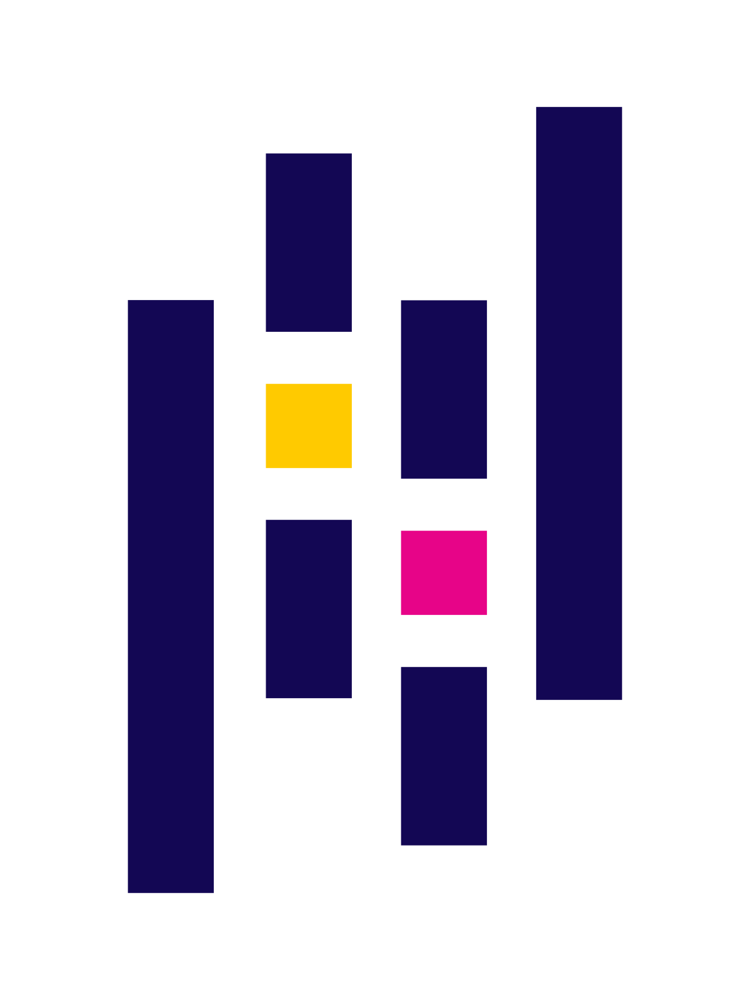

# Hi there 👋 I'm Pannatron (Tan)

🎓 Computer Science student  
📍 Kasetsart University, Faculty of Science  
🌱 Interested in Data Analyst and Business & System Analysis

## 🧑‍💻 About Me
- 📈 Enjoy turning traditional business processes into clear system flows and improving product usability
- 📚 Currently learning System Analysis, UX Thinking, and Data Tools
- 🎯 My goal is to develop strong Data Analyst skills and grow into a Data Scientist.

## 🏆 Certifications & Learning
- [Salesforce Trailhead Badges ☁️](https://www.salesforce.com/trailblazer/pannatron-sr)  
- [Tableau Public Projects 📊](https://public.tableau.com/app/profile/pannatron.sr)  

## 🔗 Connect with Me

  

⭐ *Feel free to explore my repositories and projects!*

## 💻 My Tech Stack 🧰
### 🌐 Frontend

 
   
   
   
  
   
   

### 🖥 Backend

 
   

### 🗄 Database

 
   

### 📊 Data & Analytics

  
  
  
  

### 🤖 Machine Learning / AI

 
   
   

### 🧠 Programming Languages

 
   
   
   
   
   

### 🎨 Design & System Tools

 
    

### 📱 Mobile & IDEs

 
   
   

  

### 🛠 Tools & Version Control

 
    

